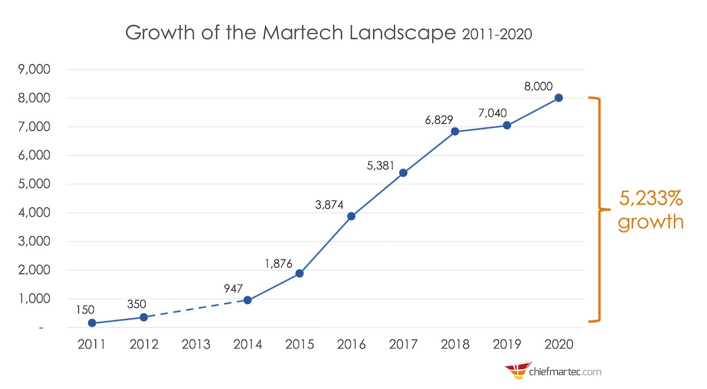

# Martech Solution Market

### Growing MarTech Market

As we have more publishers in the market, even good services find it more difficult to reach users and get them to use their services. There are a growing number of Martech solutions that aim to help boost user acquisition and traction (refer to [chiefmartec](https://chiefmartec.com/2020/04/marketing-technology-landscape-2020-martech-5000/)).&#x20;

These Martech solutions are very costly, not easy to use, and often hard to increase user engagement successfully. Publishers and advertisers often waste their money and fail to achieve user growth.

### How TICKL Works Better than MarTech

In the **TICKL** platform, publishers can create a list of missions to increase user engagement of their services. For instance, a publisher that services a study timer can directly reward users to study 1+ hour. It helps increase the usage frequency of publishers' services.&#x20;

It's also cost-effective. If a user fails to earn rewards, publishers don’t need to spend ad costs. With this mechanism, publishers can expect immediate uplift in user engagement with a given ad investment.

**TICKL** publishers can create missions they want as user actions. Publishers have distinctive levers for their growth which require customization in setting user actions for rewards. Mission creators to set up a variety of missions through embedded **TICKL** SDK and its admin. Mission creators can check if users performed actions as intended and reward them accordingly.

